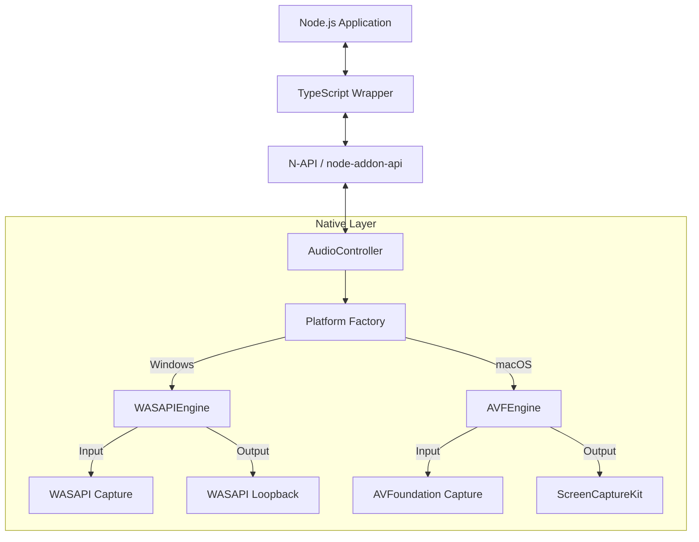

# Architecture Design

## Overview

Native Audio SDK is a Node.js addon providing high-performance, low-latency audio recording for Windows and macOS. It bridges JavaScript's asynchronous event-driven model with native real-time audio APIs.

### Design Philosophy

The SDK uses a unified **input/output** device model:
- **Input devices**: Audio sources (microphones) - consistent across platforms
- **Output devices**: System audio capture - platform-specific implementations

**Key Design Principle**: All devices have valid IDs, and recording requires both `deviceType` and `deviceId` for cross-platform consistency.

## Device Model

### Unified Interface

```
┌───────────────────────────────────────────────────────────────┐
│                      AudioRecorder API                         │
├───────────────────────────────────────────────────────────────┤
│  getDevices('input')  → [{id, name, type, isDefault}, ...]    │
│  getDevices('output') → [{id, name, type, isDefault}, ...]    │
│                                                                │
│  start({ deviceType: 'input',  deviceId: 'mic-uuid' })        │
│  start({ deviceType: 'output', deviceId: 'speaker-uuid' })    │
│  start({ deviceType: 'output', deviceId: 'system' })  // macOS│
└───────────────────────────────────────────────────────────────┘
                              │
              ┌───────────────┴───────────────┐
              ▼                               ▼
┌───────────────────────────┐   ┌───────────────────────────┐
│         Windows           │   │          macOS            │
├───────────────────────────┤   ├───────────────────────────┤
│ Input Devices:            │   │ Input Devices:            │
│  id: "{guid-1}"           │   │  id: "BuiltInMic-xxx"     │
│  id: "{guid-2}"           │   │  id: "USBMic-xxx"         │
│  id: "{guid-3}"           │   │  id: "ExtMic-xxx"         │
├───────────────────────────┤   ├───────────────────────────┤
│ Output Devices:           │   │ Output Devices:           │
│  id: "{speaker-guid}"     │   │  id: "system" (constant)  │
│  id: "{headphone-guid}"   │   │  name: "System Audio"     │
│  id: "{hdmi-guid}"        │   │  (single virtual device)  │
└───────────────────────────┘   └───────────────────────────┘
```

### Device ID Convention

| Platform | Device Type | ID Format | Example                           |
| -------- | ----------- | --------- | --------------------------------- |
| Windows  | Input       | GUID      | `{0.0.1.00000000}.{abc-123-...}`  |
| Windows  | Output      | GUID      | `{0.0.0.00000000}.{def-456-...}`  |
| macOS    | Input       | UUID      | `BuiltInMicrophoneDevice`         |
| macOS    | Output      | Constant  | `system` (SYSTEM_AUDIO_DEVICE_ID) |

### Platform Differences

| Aspect               | Windows                               | macOS                         |
| -------------------- | ------------------------------------- | ----------------------------- |
| **Input Devices**    | Multiple (WASAPI capture)             | Multiple (AVFoundation)       |
| **Output Devices**   | Multiple (WASAPI loopback per device) | Single virtual device         |
| **Output Device ID** | Actual device GUID                    | Always `"system"`             |
| **Permissions**      | None required                         | Screen Recording + Microphone |
| **Min OS Version**   | Windows 7+                            | macOS 13.0+ (for output)      |

## System Architecture



## Core Components

### 1. TypeScript Layer (`src/`)

**Responsibilities:**
- Type-safe API for consumers
- Parameter validation (deviceType + deviceId required)
- Event emission (data, error)
- Device type filtering

**Key Types:**
```typescript
// Constant for macOS system audio
const SYSTEM_AUDIO_DEVICE_ID = 'system';

type DeviceType = 'input' | 'output';

interface AudioDevice {
  id: string;        // Always has a value
  name: string;
  type: DeviceType;
  isDefault: boolean;
}

interface RecordingConfig {
  deviceType: DeviceType;  // Required: 'input' or 'output'
  deviceId: string;        // Required: from getDevices()
}
```

### 2. N-API Binding Layer (`native/main.cpp`, `native/AudioController.cpp`)

**Responsibilities:**
- Marshal data between V8 and C++
- Object wrapping via `Napi::ObjectWrap`
- Thread-safe callbacks via `Napi::ThreadSafeFunction`
- Validate deviceType and deviceId parameters

**Key Mechanism:**
```cpp
// ThreadSafeFunction enables safe audio data streaming from 
// native audio threads to the JS main thread
auto tsfn = Napi::ThreadSafeFunction::New(env, callback, "AudioCallback", 0, 1);

// Called from audio thread
tsfn->BlockingCall(data, [](Napi::Env env, Napi::Function cb, Data* data) {
    // Runs on JS main thread
    cb.Call({Napi::Buffer::Copy(env, data->ptr, data->size)});
});
```

### 3. AudioEngine Interface (`native/AudioEngine.h`)

Abstract base class defining the contract for platform implementations:

```cpp
class AudioEngine {
public:
  using DataCallback = std::function<void(const uint8_t*, size_t)>;
  using ErrorCallback = std::function<void(const std::string&)>;

  // Start recording with explicit device type and ID
  // deviceType: "input" or "output"
  // deviceId: device identifier from GetDevices() (never empty)
  virtual void Start(const std::string& deviceType,
                     const std::string& deviceId, 
                     DataCallback dataCb, 
                     ErrorCallback errorCb) = 0;
  
  virtual void Stop() = 0;
  
  // Returns all devices with valid id and type fields
  virtual std::vector<AudioDevice> GetDevices() = 0;
  
  virtual AudioFormat GetDeviceFormat(const std::string& deviceId) = 0;
  
  // Constant for system-wide audio capture (macOS)
  static constexpr const char* SYSTEM_AUDIO_DEVICE_ID = "system";
};
```

### 4. Platform Implementations

#### Windows: WASAPIEngine (`native/win/`)

**Input Recording (Microphones):**
```
IMMDeviceEnumerator
       │
       ▼ EnumAudioEndpoints(eCapture)
IMMDeviceCollection ──► List of capture devices (with GUIDs)
       │
       ▼ GetDevice(deviceId)
IMMDevice ──► IAudioClient ──► IAudioCaptureClient
                   │
                   ▼ Event-driven capture loop
              PCM Data ──► DataCallback
```

**Output Recording (Loopback):**
```
IMMDeviceEnumerator
       │
       ▼ EnumAudioEndpoints(eRender)
IMMDeviceCollection ──► List of render devices (with GUIDs)
       │
       ▼ GetDevice(deviceId)
IMMDevice ──► IAudioClient (AUDCLNT_STREAMFLAGS_LOOPBACK)
                   │
                   ▼ Captures audio being played to device
              PCM Data ──► DataCallback
```

#### macOS: AVFEngine (`native/mac/`)

**Input Recording (Microphones):**
```
AVCaptureDeviceDiscoverySession
       │
       ▼ devices(mediaType: .audio)
[AVCaptureDevice] ──► List of input devices (with uniqueID)
       │
       ▼
AVCaptureSession
       │
       ├── AVCaptureDeviceInput (selected device)
       │
       └── AVCaptureAudioDataOutput
                   │
                   ▼ captureOutput:didOutputSampleBuffer:
              CMSampleBuffer ──► DataCallback
```

**Output Recording (System Audio):**
```
deviceId == "system" (SYSTEM_AUDIO_DEVICE_ID)
       │
       ▼
SCShareableContent
       │
       ▼ getShareableContent()
SCContentFilter (display, excludingWindows: [])
       │
       ▼
SCStream (capturesAudio: true)
       │
       ▼ stream:didOutputSampleBuffer:ofType:.audio
CMSampleBuffer ──► AudioConverter ──► DataCallback
```

## Threading Model

```
┌──────────────────────────────────────────────────────────┐
│                    JS Main Thread                         │
│  - API calls (start, stop, getDevices)                   │
│  - Event emission ('data', 'error')                      │
│  - Buffer allocation and callback execution              │
└────────────────────────┬─────────────────────────────────┘
                         │ ThreadSafeFunction
                         │
┌────────────────────────┴─────────────────────────────────┐
│                    Audio Thread                           │
│  Windows: High-priority thread with WaitForSingleObject  │
│  macOS: GCD dispatch queue or AVFoundation callback      │
│                                                           │
│  - Receive raw audio data from OS                        │
│  - Format conversion (Float32 → Int16)                   │
│  - Invoke ThreadSafeFunction::BlockingCall               │
└──────────────────────────────────────────────────────────┘
```

## Data Pipeline

```
┌─────────────┐    ┌──────────────┐    ┌─────────────┐    ┌──────────┐
│ OS Audio    │───►│ Format       │───►│ Thread-Safe │───►│ JS Event │
│ Buffer      │    │ Conversion   │    │ Transfer    │    │ Emission │
│             │    │              │    │             │    │          │
│ Float32/    │    │ ──► Int16    │    │ BlockingCall│    │ 'data'   │
│ Int24/32    │    │ Native rate  │    │ Buffer copy │    │ Buffer   │
└─────────────┘    └──────────────┘    └─────────────┘    └──────────┘
```

**Output Format (Fixed):**
- Sample Rate: Device native (commonly 44.1kHz or 48kHz)
- Bit Depth: 16-bit signed integer
- Channels: Preserved from source (Mono/Stereo)
- Endianness: Little Endian

## Error Handling Strategy

| Layer      | Error Type                  | Handling                      |
| ---------- | --------------------------- | ----------------------------- |
| TypeScript | Missing deviceType/deviceId | Throw synchronously           |
| TypeScript | Invalid device type         | Throw synchronously           |
| N-API      | Device not found            | Throw JS exception            |
| N-API      | Type/ID mismatch            | Throw JS exception            |
| Native     | Runtime errors              | ErrorCallback → 'error' event |
| Native     | Critical failures           | Stop recording, emit error    |

## Security & Permissions

### macOS
- **Screen Recording permission** required for output capture (ScreenCaptureKit)
- **Microphone permission** required for input capture
- Permissions requested on first access

### Windows
- No special permissions required
- Audio device access granted to all applications

## Future Considerations

1. **Multi-device recording**: Capture from multiple devices simultaneously
2. **Audio mixing**: Combine input + output streams
3. **Sample rate selection**: Allow custom output sample rates
4. **Channel mapping**: Support for surround sound configurations
